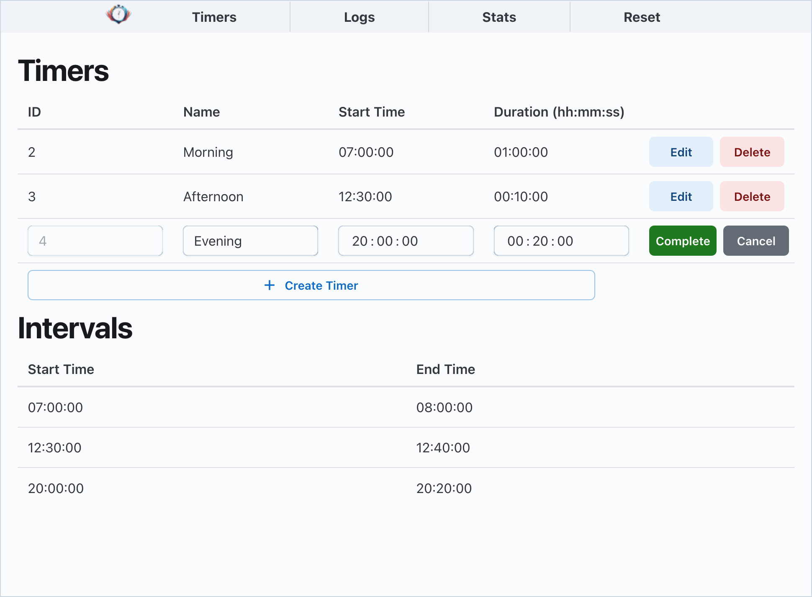

<p align="center">
    
</p>

[](https://github.com/colin-nolan/garden-watering/actions/workflows/ci.yml) [](https://codecov.io/gh/colin-nolan/timeventx)

# Timeventx

Timevente */taɪmventeks/* is a system for scheduling an event to be performed at programmable times each day (e.g. watering plants, feeding fish). It is designed to be ran on a RP2040 microcontroller (tested with a [Raspberry Pi Pico W](https://www.raspberrypi.com/products/raspberry-pi-pico/)) running [MicroPython `>=1.21.0`](https://micropython.org/download/RPI_PICO_W/). The system features a static frontend web UI to:

- Set timers.
- View set timer intervals.
- View system logs.
- View system configuration.
- View system stats (CPU usage, RAM usage, etc.)
- Trigger a restart.



## Usage

### Build

To build files for a device, including the configuration:

```text
make build [API_SERVER_LOCATION=backend_api_location (default: /api/v1)] [ARCH=architecture (default: armv6m; examples: armv6m, any)]
```

The following environment variables must be set:

| Environment Variable                 | Description                                                                                                                 | Example                  |
| ------------------------------------ | --------------------------------------------------------------------------------------------------------------------------- | ------------------------ |
| `TIMEVENTX_WIFI_SSID`                | Name of Wi-Fi network to connect                                                                                            | `homewifi`               |
| `TIMEVENTX_WIFI_PASSWORD`            | Password for the Wi-Fi network                                                                                              | `password123`            |
| `TIMEVENTX_ACTION_CONTROLLER_MODULE` | Location of module that sets the action to perform when a timer triggers ([see example](backend/timeventx/actions/noop.py)) | `timeventx.actions.noop` |

Additional configuration is possible:

| Environment Variable                   | Description                                                                                                     | Default Value |
| -------------------------------------- | --------------------------------------------------------------------------------------------------------------- | ------------- |
| `TIMEVENTX_LOG_LEVEL`                  | Determines log verbosity - [see possible values](https://docs.python.org/3/library/logging.html#logging-levels) | logging.INFO  |
| `TIMEVENTX_LOG_FILE_LOCATION`          | Where logs should be written to                                                                                 | /main.log     |
| `TIMEVENTX_TIMERS_DATABASE_LOCATION`   | Location of persistent database storing timer timers                                                            | /data/timers  |
| `TIMEVENTX_FRONTEND_ROOT_DIRECTORY`    | Directory containing built frontend code                                                                        | /frontend     |
| `TIMEVENTX_BACKEND_PORT`               | Port to run backend on                                                                                          | 80            |
| `TIMEVENTX_BACKEND_INTERFACE`          | Network interface to run backend on                                                                             | 0.0.0.0       |
| `TIMEVENTX_RESTART_ON_ERROR`           | Whether the device should restart if an error is encountered                                                    | True          |
| `TIMEVENTX_BASE64_ENCODED_CREDENTIALS` | Enables basic authentication when set to base64 encoded credentials of users in the form `user:pass,user2:pass` | None          |

### Deploy

To deploy the built files (see section on building above) to a device:

```shell
./scripts/deploy.sh [-d] [architecture (default: armv6m)] [device (default: /dev/ttyACM0)]
```

where `-d` deletes all existing files on the device first - including any the timers configuration database! It may be useful if the device contains legacy files.

The device needs to be reset to start the application, e.g.:

```shell
mpremote reset
```

## Legal

AGPL v3 (contact for other licencing). Copyright 2023, 2025 Colin Nolan.

This work is in no way related to any company that I may work for.
