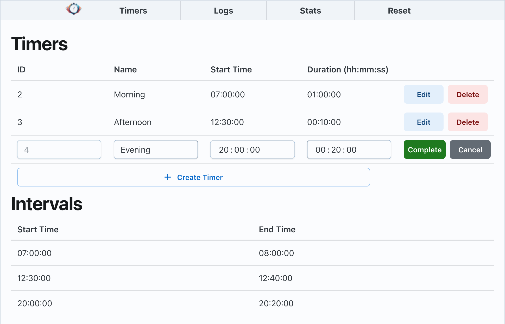

<p align="center">
    
</p>

[](https://ci.colinnolan.uk/colin-nolan/timeventx) [](https://codecov.io/gh/colin-nolan/timeventx)

# Timeventx

This system is designed to be ran on a RP2040 microcontroller, specifically a [Raspberry Pi Pico](https://www.raspberrypi.com/products/raspberry-pi-pico/).

The system features a static frontend web UI to:

- Set timers.
- View set timer intervals.
- View system logs.
- View system stats (CPU usage, RAM usage, etc.)
- Trigger a restart.



## Usage

### Build

To build files for a device:

```text
make build API_SERVER_LOCATION=<backend_api_location> [ARCH=architecture (default: any)]
```

The following environmnet variables must be set:

```text
TIMEVENTX_WIFI_SSID
TIMEVENTX_WIFI_PASSWORD
```

### Deploy

To deploy the built files to a device:

```shell
./scripts/deploy.sh -d [architecture (default: any)] [device (default: /dev/ttyACM0)]
```

The following environmnet variables must be set:

```text
TIMEVENTX_WIFI_SSID 
TIMEVENTX_WIFI_PASSWORD
TIMEVENTX_ACTION_CONTROLLER_MODULE
```

Additional configuration is possible

| Environment Variable                 | Default Value |
| ------------------------------------ | ------------- |
| `TIMEVENTX_LOG_LEVEL`                | logging.INFO  |
| `TIMEVENTX_LOG_FILE_LOCATION`        | /main.log     |
| `TIMEVENTX_TIMERS_DATABASE_LOCATION` | /data/timers  |
| `TIMEVENTX_FRONTEND_ROOT_DIRECTORY`  | /frontend     |
| `TIMEVENTX_BACKEND_PORT`             | 8080          |
| `TIMEVENTX_BACKEND_INTERFACE`        | 0.0.0.0       |
| `TIMEVENTX_RESTART_ON_ERROR`         | True          |

To manually interact with the RP2040 device:

- `mpremote`

## Legal

AGPL v3 (contact for other licencing). Copyright 2023 Colin Nolan.

This work is in no way related to any company that I may work for.
